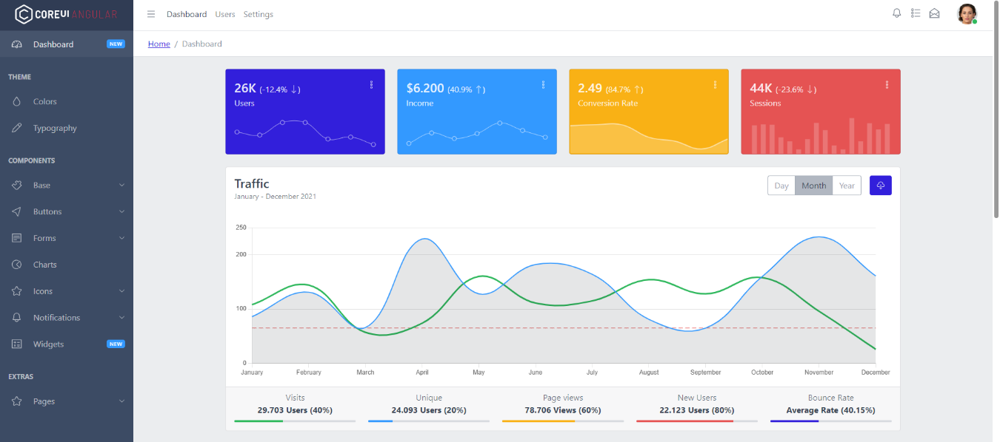
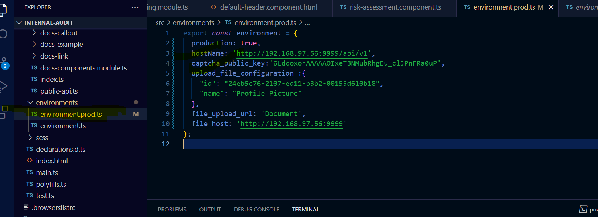
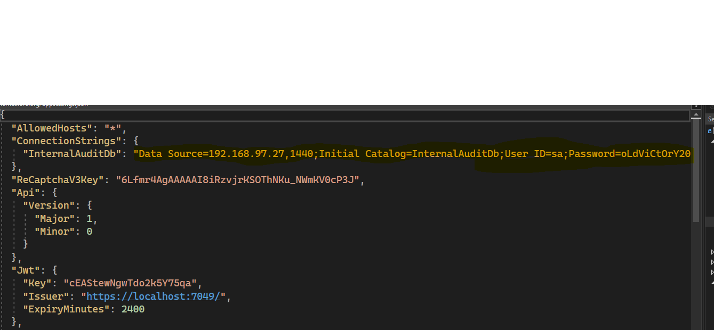

# Internal Audit

Internal audits evaluate a company’s internal controls, including its corporate governance and accounting processes. These audits ensure compliance with laws and regulations and help to maintain accurate and timely financial reporting and data collection.  

Internal audits also provide management with the tools necessary to attain operational efficiency by identifying problems and correcting lapses before they are discovered in an external audit. 

## Getting started

To make it easy for you to get started with GitLab, here's a list of recommended next steps.


## Add your files

- [ ] [Create](https://docs.gitlab.com/ee/user/project/repository/web_editor.html#create-a-file) or [upload](https://docs.gitlab.com/ee/user/project/repository/web_editor.html#upload-a-file) files
- [ ] [Add files using the command line](https://docs.gitlab.com/ee/gitlab-basics/add-file.html#add-a-file-using-the-command-line) or push an existing Git repository with the following command:

```
cd existing_repo
git remote add origin http://192.168.100.42/team-ia/internal-audit.git
git branch -M master
git push -uf origin master
```

## Integrate with your tools

- [ ] [Set up project integrations](http://192.168.100.42/team-ia/internal-audit/-/settings/integrations)

## Collaborate with your team

- [ ] [Invite team members and collaborators](https://docs.gitlab.com/ee/user/project/members/)
- [ ] [Create a new merge request](https://docs.gitlab.com/ee/user/project/merge_requests/creating_merge_requests.html)
- [ ] [Automatically close issues from merge requests](https://docs.gitlab.com/ee/user/project/issues/managing_issues.html#closing-issues-automatically)
- [ ] [Enable merge request approvals](https://docs.gitlab.com/ee/user/project/merge_requests/approvals/)
- [ ] [Automatically merge when pipeline succeeds](https://docs.gitlab.com/ee/user/project/merge_requests/merge_when_pipeline_succeeds.html)

## Test and Deploy

Use the built-in continuous integration in GitLab.

- [ ] [Get started with GitLab CI/CD](https://docs.gitlab.com/ee/ci/quick_start/index.html)
- [ ] [Analyze your code for known vulnerabilities with Static Application Security Testing(SAST)](https://docs.gitlab.com/ee/user/application_security/sast/)
- [ ] [Deploy to Kubernetes, Amazon EC2, or Amazon ECS using Auto Deploy](https://docs.gitlab.com/ee/topics/autodevops/requirements.html)
- [ ] [Use pull-based deployments for improved Kubernetes management](https://docs.gitlab.com/ee/user/clusters/agent/)
- [ ] [Set up protected environments](https://docs.gitlab.com/ee/ci/environments/protected_environments.html)


# Development Guidelines
## Required technologies
The solution is built with using 
- Microsoft technologies
- .NET core, Web Services
- SQL Server
- Angular 13
- HTML5
- CSS
- Typescript  
## Backend
Pre-requisites
- Visual Studio 2022
- .NET 6 core

Clone the project repo:

```
git clone http://192.168.100.42/team-ia/internal-audit.git
```
Move to API directory:

```
cd internal-audit/src/api/Internal.Audit
```
Open the solution with visual studio, then build & run the project.

## Frontend
Pre-requisites
- Visual Studio Code
- **Node** To install : 
[Node](https://phoenixnap.com/kb/install-node-js-npm-on-windows) 
- **Angular 13+** To install run command ``` npm install -g @angular/cli ```


Move to UI directory:
```
cd internal-audit/src/ui/internal.audit
```


Open the angular project with visual studio code to edit & run these commands to start the project:
```
npm install
ng serve -o
```
If you are running any angular command e.g. ng serve, ng build, ng new, ng generate etc. from Visual Studio Code Terminal or from command prompt and getting a error related to execution policy, then you can go through the below solution to fix above issue.

Solution: Run the following command from the same terminal or command prompt and re-run the ng command to check if it works on your machine:
```
Set-ExecutionPolicy RemoteSigned -Scope CurrentUser
```

## Architecture Overview


### Backend
- CQRS – Command Query Responsibility Segregation is used here, for insert, update, delete system will use Entity framework core and for selecting data it will use Dapper. CQRS stands for Command and Query Responsibility Segregation, a pattern that separates read and update operations for a data store. Implementing CQRS in your application can maximize its performance, scalability, and security. The flexibility created by migrating to CQRS allows a system to better evolve over time and prevents update commands from causing merge conflicts at the domain level. 


- Mediator – For loosely couple and easy readability mediator pattern is followed here. The Mediator design pattern defines an object that encapsulates how a set of objects interact. Mediator promotes loose coupling by keeping objects from referring to each other explicitly, and it lets you vary their interaction independently. 

 

- Auto Mapper – Data transfer object (DTO) is used for so that we don’t expose our table structure to client. It is a popular object-to-object mapping library that can be used to map objects belonging to dissimilar types. As an example, you might need to map the DTOs (Data Transfer Objects) in your application to the model objects. Auto Mapper saves the tedious effort of having to manually map one or more properties of such incompatible types 


- Fluent API – For model validation and sending mail fluent API is used. Fluent API is an advanced way of specifying model configuration that covers everything that data annotations can do in addition to some more advanced configuration not possible with data annotations. Data annotations and the fluent API can be used together, but Code First gives precedence to Fluent API > data annotations > default conventions. 

 

  - Fluent API is another way to configure your domain classes. 

  - The Code First Fluent API is most commonly accessed by overriding the OnModelCreating method on your derived DbContext. 

  - Fluent API provides more functionality for configuration than DataAnnotations. Fluent API supports the following types of mappings. 


### Frontend
- User Interface – The user interface has built with using HTML5, CSS, JavaScript, Bootstrap. The main application targeted for desktops, Laptops and Mobile. 
)

- APP – This is the mother module of Internal-Audit Frontend. It is the root module of Internal-Audit Application. App Routing mapping the URLs to a specific function that will handle the logic for that URL. 

   - Example: In our application, the URL (“/”) is associated with the root URL. So if our site’s domain was www.internalaudit.com and we want to add routing to “www.internalaudit.com/ #/dashboard”, we would use “#/dashboard”. To bind a function to an URL path we use the app route decorator. Here we will decide which module will open first. 


- Core – This is the main module for all kind of services where back end api will be connected with front end. Currently this module is divided into five parts. which are AUTH, CONSTANTS, GUARDS, INTERCEPTORS, SERVICES. 
  - AUTH -- Here JSON Web Tokens can be used to establish a user session, JWTs are digitally signed JSON payloads, encoded in a URL-friendly string format. If JWTs are used for Authentication, they will contain at least a user ID and an expiration timestamp. 

  - CONSTANTS –  All kind of constant policies would be written here. Like Email or Phone Regular Expression are written here in a class 

  - GUARDS –  Authentication Guard, Role Guard, User Guard etc. are stored in this folder. The guard is use to check the user or role is valid or not.   

  - INTERCEPTORS – HttpInterceptor will be implemented here using jwtInterceptor. Authorization header will be built here with jwt token. 

  - SERVICES -- All type of service will be implemented here with a common service. Common service will handle most of the api. If any service cannot perform with common service, then the service will be created in this folder individually 

- Views – All the Modules views, component and typescript will be held in this portion. One stage of routing will be implemented here and the main routing will be covered by app-routing.  
 

- Model – All the database table and property are here in the model folder. 

# Deployment Guidelines
### Prerequisite to install
- IIS
- .NET 6 SDK for hosting. You can install it from here: [.NET 6](https://dotnet.microsoft.com/en-us/download/dotnet/thank-you/runtime-aspnetcore-6.0.6-windows-hosting-bundle-installer)

## Publish Backend
- Step 1: Open the source code with Visual Studio on your local machine
- Step 2: Right click on the API project (Internal.Audit.Api), then select "Publish".
- Step 3: Select Target folder, some files will be published to the folder. Later, you will copy these file from your local machine to the server. 

- Step 4: Open IIS in your desired server where you want to host the API
- Step 5: Add a website by right click on sites with a application pool that contains .NET 6 sdk, you have to give a path while adding the website. Copy the files generated in Step 3 to this folder. You also need to specify the port number in this step.
  - If there is no application pool with .NET 6 sdk, create one first as per the screenshot. Also enable 32-bit applications for this application pool from advanced setting by right clicking the application pool.
  
- Step 6: Now just start the Site. You can verify by accessing http://serverIp:port/swagger/index.html if the swagger is kept on.

## Publish Frontend

- Step 1: Just run the coomand ``` ng build --prod ```, it will create a folder named "dist" in the source folder. Copy these files.
- Step 2: Open IIS in your desired server where you want to host the API
- Step 3: Add a website by right click on sites with any application pool with a port number.
- Step 4: Now just start the Site and access the UI. [Use the port number specified in Step 3]

### Configuration guideline
- For the API connection use the address of API (where you already had published the API) port number specified in the Step 5 of publishing the Backend API. You can set the API address & IP in the following file of Frontend:
  
- You can also change the connection string before publishing the source code in the following file: (appsettings.json)
  

## IMPORTANT NOTES!


**Note for Pull Requests (PRs)**: We accept pull requests from the community. When doing it, please do it onto the **DEV branch** which is the consolidated work-in-progress branch. Do not request it onto **master** branch.

## Usage


## Contributing
Pull requests are welcome. For major changes, please open an issue first to discuss what you would like to change.

Please make sure to update tests as appropriate.