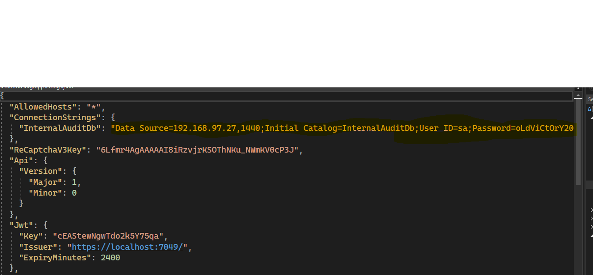

# Internal Audit

Internal audits evaluate a company's internal controls, including its corporate governance and accounting processes. These audits ensure compliance with laws and regulations and help to maintain accurate and timely financial reporting and data collection.  

Internal audits also provide management with the tools necessary to attain operational efficiency by identifying problems and correcting lapses before they are discovered in an external audit. 

## Getting started
# Development Guidelines

### Git Installation
Git is a DevOps tool for source code management—an open-source version control system (VCS) used to handle small to very large projects efficiently. Git is used to tracking changes in the source code, supporting non-linear development so that multiple developers can work together in near real-time
For installing Git on your device please follow this link 
[Install Git]("https://git-scm.com/book/en/v2/Getting-Started-Installing-Git").

### Clone GIT Repository
If git is already installed on your device you need to make a clone or copy of Internal-Audit project repository in a directory of your device.
You can follow the bellow to clone a repository on your device
 [Clone GIT Repository](https://asainternational.sharepoint.com/:t:/s/ASAIDevTeam/EdVVBcMEb3pHmzTJFOf2lFsBNcSPTVHVUXI1Bfgzq1CXwQ?e=FbkUXe).
 

## Required technologies
The solution is built with using 
- .NET core 6, Web API
- SQL Server 2019 or higher
- Angular 13
- HTML5
- CSS
- Typescript  
## Pre-requisites

- Visual Studio 2022 or higher version
- .NET 6 core
- Visual Studio Code
- **Node** To install : 
[Node](https://phoenixnap.com/kb/install-node-js-npm-on-windows) 
- **Angular 13+** To install run command ``` npm install -g @angular/cli ```

Clone the project repo:

```
git clone http://192.168.100.42/team-ia/internal-audit.git
```
## Backend
Move to **../api/Internal.Audit** directory:

```
cd internal-audit/src/api/Internal.Audit
```
Open the solution with visual studio. 
Internal Audit database is up in 192.168.97.27,1440 server. If you have database in your local server please change the connection string in appsettings.json then build & run the project.
 


## Frontend

Move to **../ui/Internal.Audit** directory:
```
cd internal-audit/src/ui/internal.audit
```


Open the angular project with visual studio code to edit & run these commands to start the project:
```
npm install
ng serve -o
```
If you are running any angular command e.g. ng serve, ng build, ng new, ng generate etc. from Visual Studio Code Terminal or from command prompt and getting a error related to execution policy, then you can go through the below solution to fix above issue.

Solution: Run the following command from the same terminal or command prompt and re-run the ng command to check if it works on your machine:
```
Set-ExecutionPolicy RemoteSigned -Scope CurrentUser
```
## IMPORTANT NOTES!


**Note for Pull Requests (PRs)**: We accept pull requests from the community. When doing it, please do it onto the **develop branch** which is the consolidated work-in-progress branch. Do not request it onto **master** branch.

## Contributing
Pull requests are welcome. For major changes, please open an issue first to discuss what you would like to change.

Please make sure to update tests as appropriate.