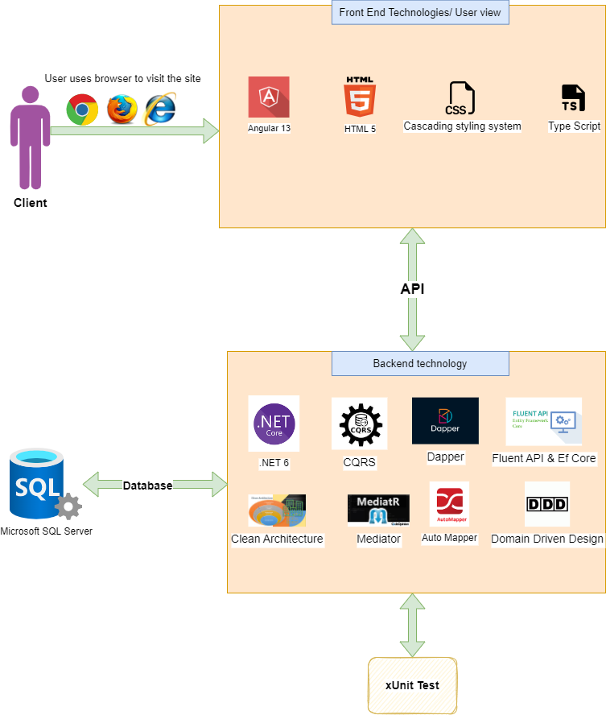

# Internal Audit

Team IA aim is to develop an end to end solution for the Audit team.

## Getting started

To make it easy for you to get started with GitLab, here's a list of recommended next steps.

Already a pro? Just edit this README.md and make it your own. Want to make it easy? [Use the template at the bottom](#editing-this-readme)!

## Add your files

- [ ] [Create](https://docs.gitlab.com/ee/user/project/repository/web_editor.html#create-a-file) or [upload](https://docs.gitlab.com/ee/user/project/repository/web_editor.html#upload-a-file) files
- [ ] [Add files using the command line](https://docs.gitlab.com/ee/gitlab-basics/add-file.html#add-a-file-using-the-command-line) or push an existing Git repository with the following command:

```
cd existing_repo
git remote add origin http://192.168.100.42/team-ia/internal-audit.git
git branch -M master
git push -uf origin master
```

## Integrate with your tools

- [ ] [Set up project integrations](http://192.168.100.42/team-ia/internal-audit/-/settings/integrations)

## Collaborate with your team

- [ ] [Invite team members and collaborators](https://docs.gitlab.com/ee/user/project/members/)
- [ ] [Create a new merge request](https://docs.gitlab.com/ee/user/project/merge_requests/creating_merge_requests.html)
- [ ] [Automatically close issues from merge requests](https://docs.gitlab.com/ee/user/project/issues/managing_issues.html#closing-issues-automatically)
- [ ] [Enable merge request approvals](https://docs.gitlab.com/ee/user/project/merge_requests/approvals/)
- [ ] [Automatically merge when pipeline succeeds](https://docs.gitlab.com/ee/user/project/merge_requests/merge_when_pipeline_succeeds.html)

## Test and Deploy

Use the built-in continuous integration in GitLab.

- [ ] [Get started with GitLab CI/CD](https://docs.gitlab.com/ee/ci/quick_start/index.html)
- [ ] [Analyze your code for known vulnerabilities with Static Application Security Testing(SAST)](https://docs.gitlab.com/ee/user/application_security/sast/)
- [ ] [Deploy to Kubernetes, Amazon EC2, or Amazon ECS using Auto Deploy](https://docs.gitlab.com/ee/topics/autodevops/requirements.html)
- [ ] [Use pull-based deployments for improved Kubernetes management](https://docs.gitlab.com/ee/user/clusters/agent/)
- [ ] [Set up protected environments](https://docs.gitlab.com/ee/ci/environments/protected_environments.html)


# Installation
## Backend
Pre-requisites
- Visual Studio 
- .NET 6 core

Clone the project repo:

```
git clone http://192.168.100.42/team-ia/internal-audit.git
```
Move to API directory:

```
cd internal-audit/src/api/Internal.Audit
```
Open the solution with visual studio, then build & run the project.

## Frontend
Pre-requisites
- Visual Studio Code
- **Node** To install : 
[Node](https://phoenixnap.com/kb/install-node-js-npm-on-windows) 
- **Angular 13+** To install run command ``` npm install -g @angular/cli ```


Move to UI directory:
```
cd internal-audit/src/ui/internal.audit
```


Open the angular project with visual studio code to edit & run these commands to start the project:
```
npm install
ng serve -o
```

## Architecture Overview



## IMPORTANT NOTES!


**Note for Pull Requests (PRs)**: We accept pull requests from the community. When doing it, please do it onto the **DEV branch** which is the consolidated work-in-progress branch. Do not request it onto **main** branch.

## Usage

```python
import foobar

# returns 'words'
foobar.pluralize('word')

# returns 'geese'
foobar.pluralize('goose')

# returns 'phenomenon'
foobar.singularize('phenomena')
```

## Contributing
Pull requests are welcome. For major changes, please open an issue first to discuss what you would like to change.

Please make sure to update tests as appropriate.

## License
[MIT](https://choosealicense.com/licenses/mit/)